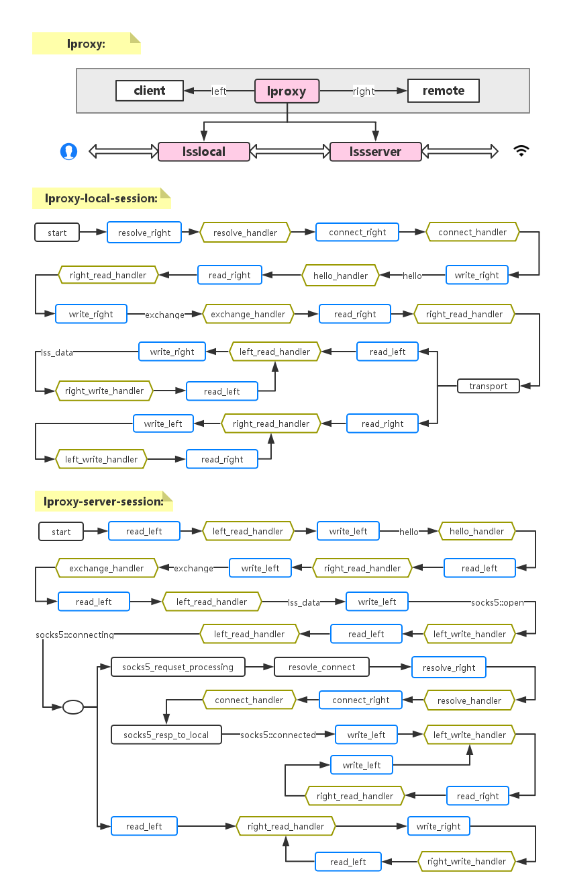

# lss

* [lss 包结构介绍](./pack.md)

* lss 基本架构 及其 session 大致流程示意图.

	* [pdf](./lproxy.pdf) 
	* [svg](./lproxy.svg)
	
	

* [压力(并发)测试](./StressTesting.md)

* 编译 lss

	1. 在编译 lss 之前，请先确保已经在 lproxy 的根目录执行了 `make init`.

		```shell
		$ cd /path/to/lproxy/ && make init
		```

	2. 在 linux 上编译示例：

		```shell
		$ cd /path/to/lproxy/src/core/lss
		$ make
		```

	3. 在 Cygwin 上编译示例：

		```shell
		$ cd /path/to/lproxy/src/core/lss
		$ make -f Makefile.Cygwin
		```

	4. 编译 `DEBUG` 版本的 lss

		```shell
		$ # 添加 DEBUG=enable 选项即可
		$ cd /path/to/lproxy/src/core/lss
		$ make DEBUG=enable        # -f Makefle.Cygwin
		```
* [how-to book](../../src/core/lss/HOWTO)